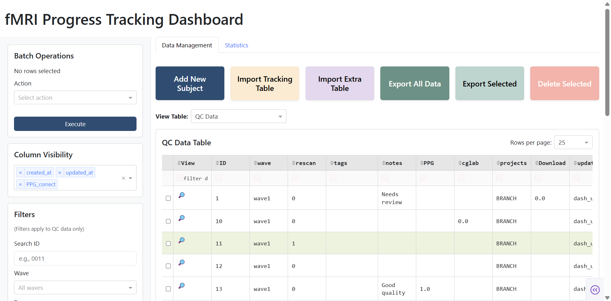
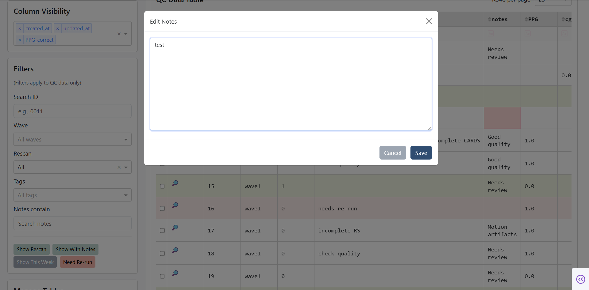
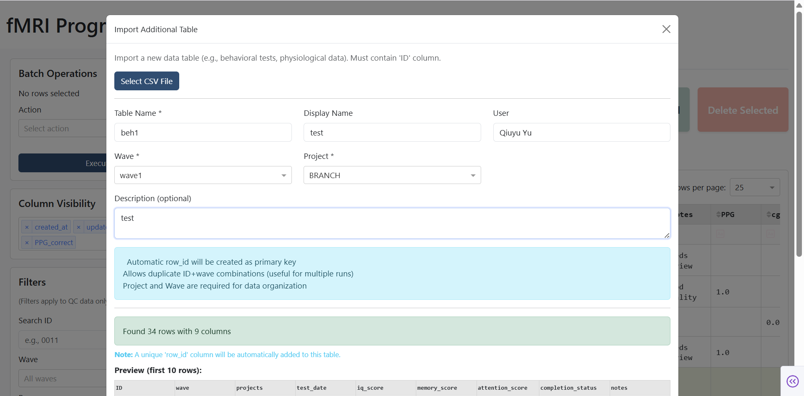
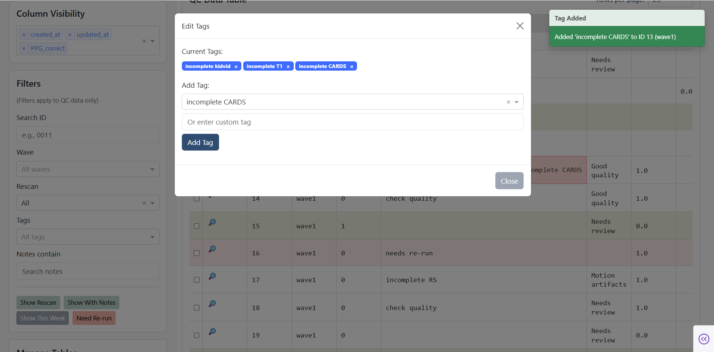
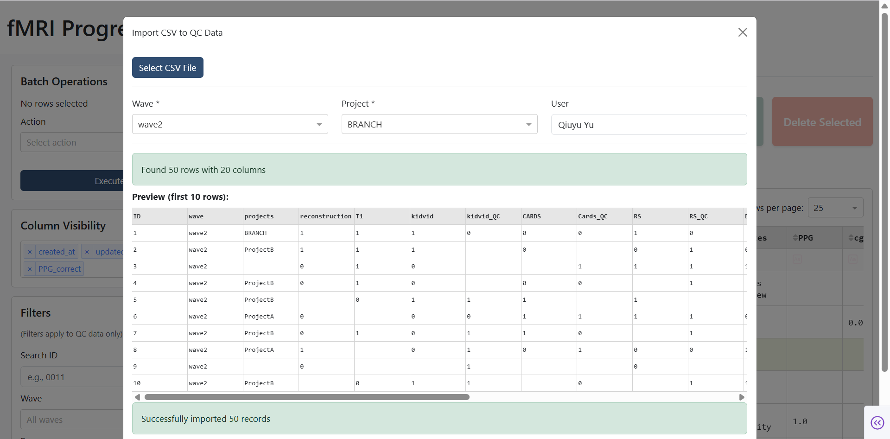
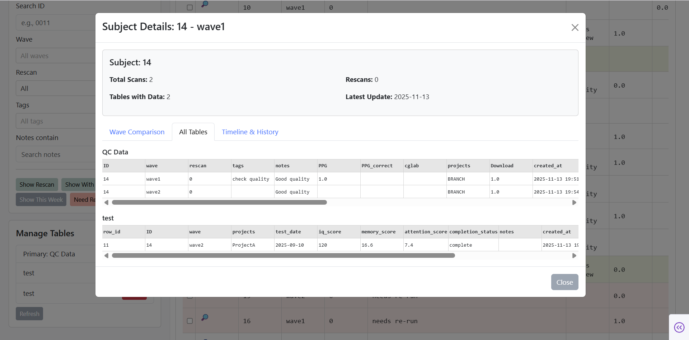
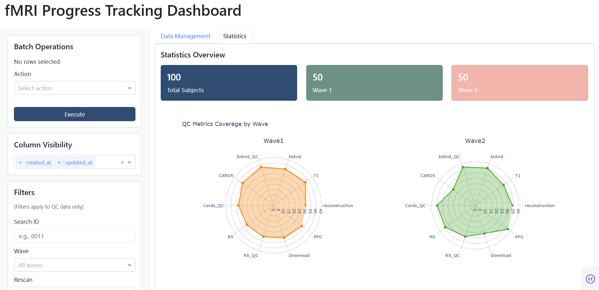
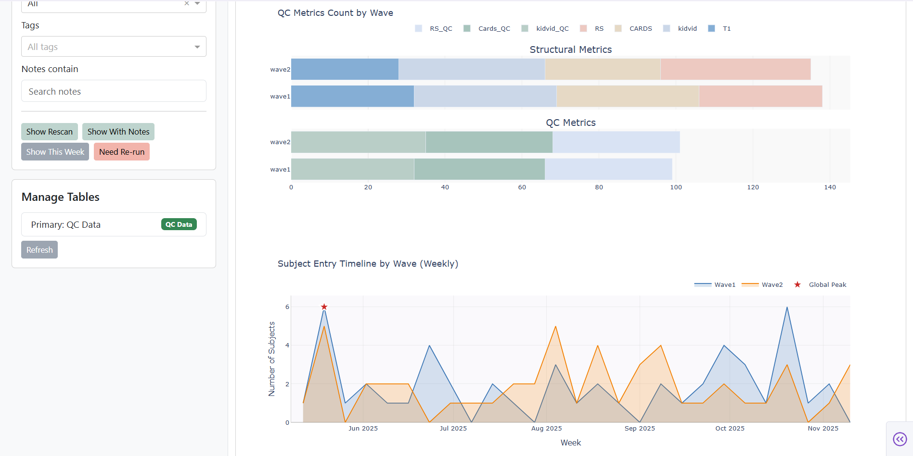

# fMRI_data_managgment_and_Progress_Tracking

A tracking platform for fMRI scans, data analysis results, and quality control built using Dash Python. This package is still under development.

# Display

## Functions

## Visualization

